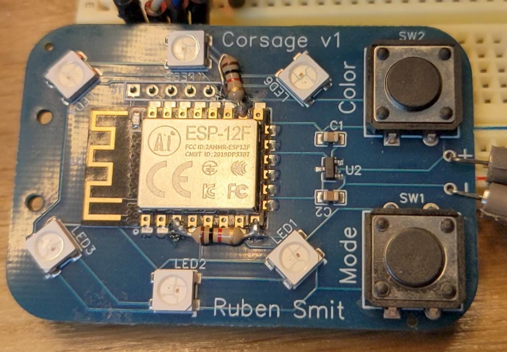
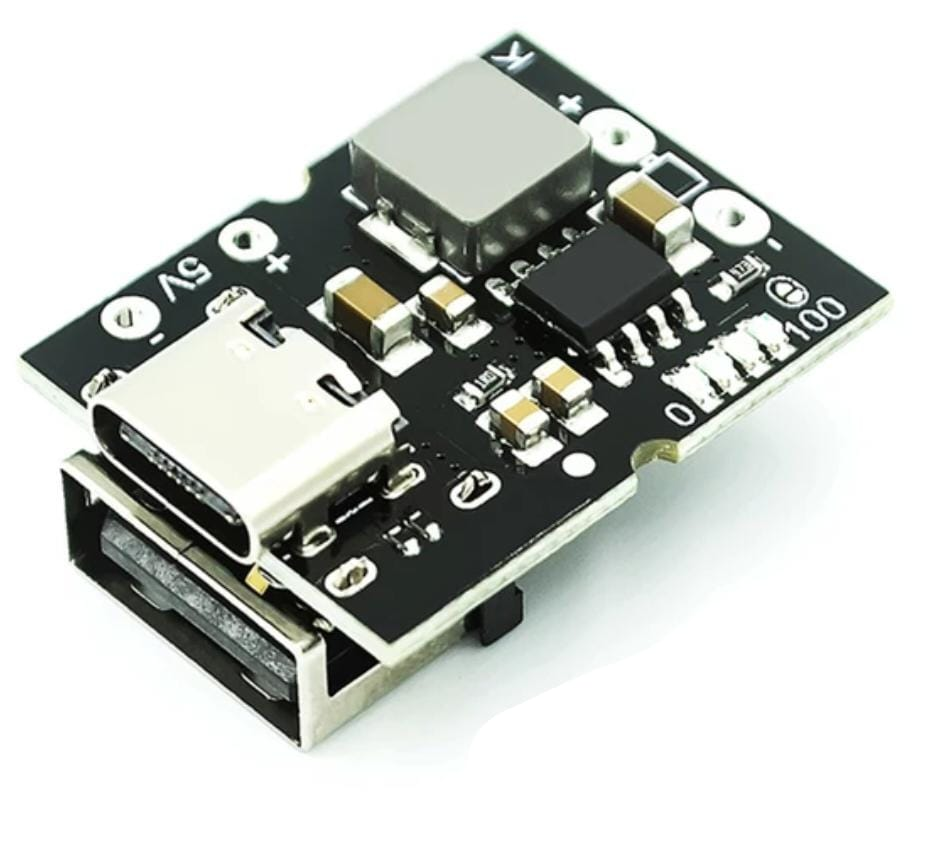

# Wireless communicating LED corsage 
This is the design and code for a communicating LED corsage. The corsage consists of a ESP8266 with a small Neopixel ring and two buttons. The buttons can be used to change the color and animation mode of the corsage. These settings are transmitted via ESP-NOW to another corsage so their color and animation modes are synced. The PCB design is meant to be worn on a suit or dress. A battery management chip and a lipo battery can be attached to the back to make it portable. This amounts to about 25 grams.

## Programming
The ESP can be programmed using a 3.3v programmer connected to the PCB programming pins who are layed out as this: `3.3v TX RX GND GPIO0`. `GPIO0` should be connected to ground. You can use a separate wire to pull the `RESET` pin to ground and reboot the chip in programming mode. I advise to connect a 5 volt powersupply to the power connector to ensure proper powering of the ESP and the neopixels.

> **Warning**
> Make sure you use a 3.3v programmer as a 5v one will break your ESP

## Electronics
The design of the pcb can be found in the `/pcb` folder. There are two minor mistakes in the pcb design, two missing resistors. These can be added manually by soldering them to the pcb. A pulldown resistor of 1K ohm on pin 8 and 10. See the image below for how to solder these.

### BMS and lipo
I suggest using a IP5306 based BMS. These have a USB-C charging port, charge indicators, battery protection circuit and a 5 volt buck-boost converter. Perfect for driving the Neopixel LEDS. These can be found for cheap on aliexpress. Combined with a 500mAh battery it gives you about 5 hours of runtime on a full charge. Only downside is that this BMS has a auto shutoff when the usage is below 50mAh. So you need to run your leds bright enough. This shortens the battery runtime unfortunately.

### PCB layout

### Schematics
